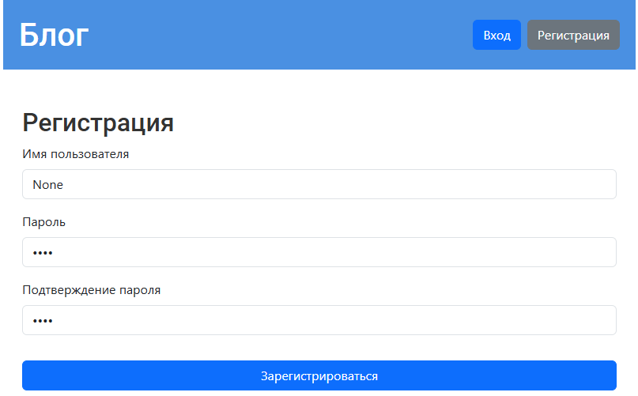

# Программирование 7 семестр

- [Лабораторная работа 1](#лабораторная-работа-1)
  - [Часть 1](#часть-1)
  - [Часть 2](#часть-2)
  - [Часть 3](#часть-3)
  - [Часть 4](#часть-4)
- [Лабораторная работа 3](#лабораторная-работа-3-введение-в-django)
- [Лабораторная работа 4](#лабораторная-работа-4-применение-форм-в-django)
- [Практическая работа Django Oauth 2.0](#практическая-работа-настройка-oauth-20-авторизации-в-django-приложении)
- [Лабораторная работа 5](#лабораторная-работа-5-django-rest-framework)

## Лабораторная работа 1

### Часть 1

#### Функция sin

- **n_iter=10000:**
  - Многопоточное решение `медленнее` на 1.62 ms в сравнении с последовательным
  - Многопроцессорное решение `медленнее` на 315.81 ms в сравнении с последовательным

- **n_iter=100000:**
  - Многопоточное решение `медленнее` на 4.07 ms в сравнении с последовательным
  - Многопроцессорное решение `медленнее` на 229.54 ms в сравнении с последовательным

- **n_iter=1000000:**
  - Многопоточное решение `медленнее` на 12.78 ms в сравнении с последовательным
  - Многопроцессорное решение `медленнее` на 181.76 ms в сравнении с последовательным

- **n_iter=100000000:**
  - Многопоточное решение `медленнее` на 1255.50 ms в сравнении с последовательным
  - Многопроцессорное решение `быстрее` на 12403.68 ms в сравнении с последовательным

#### Функция cos

- **n_iter=10000:**
  - Многопоточное решение `медленнее` на 0.98 ms в сравнении с последовательным
  - Многопроцессорное решение `медленнее` на 195.68 ms в сравнении с последовательным

- **n_iter=100000:**
  - Многопоточное решение `медленнее` на 2.07 ms в сравнении с последовательным
  - Многопроцессорное решение `медленнее` на 220.50 ms в сравнении с последовательным

- **n_iter=1000000:**
  - Многопоточное решение `медленнее` на 11.91 ms в сравнении с последовательным
  - Многопроцессорное решение `медленнее` на 95.57 ms в сравнении с последовательным

- **n_iter=100000000:**
  - Многопоточное решение `медленнее` на 1328.17 ms в сравнении с последовательным
  - Многопроцессорное решение `быстрее` на 12742.94 ms в сравнении с последовательным

#### Функция tan

- **n_iter=10000:**
  - Многопоточное решение `медленнее` на 2.54 ms в сравнении с последовательным
  - Многопроцессорное решение `медленнее` на 184.84 ms в сравнении с последовательным

- **n_iter=100000:**
  - Многопоточное решение `медленнее` на 3.52 ms в сравнении с последовательным
  - Многопроцессорное решение `медленнее` на 168.27 ms в сравнении с последовательным

- **n_iter=1000000:**
  - Многопоточное решение `медленнее` на 12.14 ms в сравнении с последовательным
  - Многопроцессорное решение `медленнее` на 86.11 ms в сравнении с последовательным

- **n_iter=100000000:**
  - Многопоточное решение `медленнее` на 1301.18 ms в сравнении с последовательным
  - Многопроцессорное решение `быстрее` на 13357.58 ms в сравнении с последовательным

> `Thread в Python ограничены Global Interpreter Lock (GIL), это можно обойти, используя другой интерпретатор или многопроцессорность, что я и сделал. Многопроцессорное решение обходит GIL, позволяя использовать все ядра процессора, но при этом вносит накладные расходы на передачу данных между процессами, а потому показывает свою эффективность только на больших вычислительных задачах.`

### Часть 2

#### Таск 1 и 2

- Поток `Thread-1` начал скачивание файла с https://picsum.photos/4000/4000
- Поток `Thread-2` начал скачивание файла с https://picsum.photos/200/200
- Поток `Thread-3` начал скачивание файла с https://picsum.photos/700/1300
- Поток `Thread-2` завершил скачивание файла 200
- Поток `Thread-3` завершил скачивание файла 1300
- Поток `Thread-1` завершил скачивание файла 4000

#### Таск 3

- Поток `Thread-1` выполняет запрос к https://www.google.com
- Поток `Thread-2` выполняет запрос к https://www.example.com
- Поток `Thread-3` выполняет запрос к https://dant4ick.ru/tgtest
- Поток `Thread-1` получил успешный ответ с https://www.google.com (код 200)
- Поток `Thread-3` получил успешный ответ с https://dant4ick.ru/tgtest (код 200)
- Поток `Thread-2` получил успешный ответ с https://www.example.com (код 200)

#### Таск 4

- Поток `Thread-1` начал вычисление факториала для числа 5
- Поток `Thread-1` завершил вычисление: факториал 5 = 120
- Поток `Thread-2` начал вычисление факториала для числа 7
- Поток `Thread-2` завершил вычисление: факториал 7 = 5040
- Поток `Thread-3` начал вычисление факториала для числа 2
- Поток `Thread-3` завершил вычисление: факториал 2 = 2
- Поток `Thread-4` начал вычисление факториала для числа 12
- Поток `Thread-4` завершил вычисление: факториал 12 = 479001600
- Поток `Thread-5` начал вычисление факториала для числа 11
- Поток `Thread-5` завершил вычисление: факториал 11 = 39916800

#### Таск 5

- Свято верить.

### Часть 3

#### Таск 1

- Время для 2 потоков/процессов: 140.974400 ms
- Время для 4 потоков/процессов: 142.803700 ms
- Время для 6 потоков/процессов: 144.080000 ms

#### Таск 2

- Снимаем 300 с счета. Текущий баланс: 1000
- После снятия: 700
- Вносим 250 на счет. Текущий баланс: 700
- После внесения: 950
- Снимаем 140 с счета. Текущий баланс: 950
- После снятия: 810

#### Таск 3

- Загрузка images\image_400x400_1.jpg с https://picsum.photos/400/400
- Загрузка images\image_800x600_2.jpg с https://picsum.photos/800/600
- Загрузка images\image_1200x800_3.jpg с https://picsum.photos/1200/800
- Загрузка images\image_500x500_4.jpg с https://picsum.photos/500/500
- Загрузка images\image_1000x1000_5.jpg с https://picsum.photos/1000/1000
- Завершена загрузка images\image_800x600_2.jpg
- Загрузка images\image_600x400_6.jpg с https://picsum.photos/600/400
- Завершена загрузка images\image_500x500_4.jpg
- Завершена загрузка images\image_400x400_1.jpg
- Завершена загрузка images\image_1000x1000_5.jpg
- Завершена загрузка images\image_1200x800_3.jpg
- Завершена загрузка images\image_600x400_6.jpg

#### Таск 4

- Данные записаны в файл example.txt
- Данные считаны из файла example.txt: Запись в файле

#### Таск 5

- Event did not occur
- Состояние события установлено.
- Event occurred
- Event occurred
- ...
- Event occurred
- Event occurred
- Событие произошло, третий поток завершает работу.
- NotOccurredThread завершил работу.
- Event occurred
- WaiterThread завершил работу.
- Состояние события сброшено.
- SetterThread завершил работу.
- Все потоки завершены. Программа завершена.

#### Таск 6

- [Producer] Добавлено: 1
- [Producer] Добавлено: 2
- [Consumer] Удалено: 1
- [Producer] Добавлено: 3
- [Producer] Добавлено: 4
- [Consumer] Удалено: 2
- [Producer] Добавлено: 5
- [Consumer] Удалено: 3
- [Consumer] Удалено: 4
- [Consumer] Удалено: 5
- [Consumer] Очередь пуста
- Работа программы завершена.

#### Таск 7

- [Сервер] Запуск рыбовприемника...
- [Клиент] Ожидаю готовности рыбовприемника...
- [Сервер] Рыбовприемник готов!
- [Сервер] Ожидаю рыбов...
- [Клиент] Отправляю рыбов серверу...
- [Клиент] Рыбовы успешно съедены!
- Клоунада завершена.

#### Таск 8

- [Thread-1] Начинаю поиск в ./test_dir
- [Thread-2] Начинаю поиск в ./test_dir
- [Thread-3] Начинаю поиск в ./test_dir
- [Thread-4] Начинаю поиск в ./test_dir
- [Thread-1] Файл найден: ./test_dir\subdir1\example.txt
- [Thread-3] Файл найден: ./test_dir\subdir1\example.txt
- [Thread-2] Файл найден: ./test_dir\subdir1\example.txt
- [Thread-4] Поиск завершён (остановлен).

### Часть 4

#### Таск 1

- Текущее время: 21:13:46
- Текущее время: 21:13:47
- Текущее время: 21:13:48
- Текущее время: 21:13:49
- Текущее время: 21:13:50

- Программа завершена.

#### Таск 2

- 2024-11-27 21:21:46
- Программа завершена.

#### Таск 3

- Задача 1 началась...
- Задача 2 началась...
- Задача 1 завершена!
- Задача 2 завершена!
- Обработка результатов началась...
- Обработан результат: Результат задачи 1
- Обработан результат: Результат задачи 2
- Обработка результатов завершена!

#### Таск 4

```
HTTP-запрос выполнен успешно!
Запрос к базе данных выполнен успешно!

Обработка результатов:

Результат HTTP-запроса:
{
    "URL": "http://rnacentral.org/api/v1/rna/URS0000001C34",
    "RNA ID": "URS0000001C34",
    "Description": "rRNA from 1 species",
    "Sequence (shortened)": "UUGACAUGCAGAGACUUCCAGAGAUGGAUUGGUGCCUUCGGGAACUCУГА...",
    "Length": 399,
    "Databases": [
        "ENA",
        "SILVA"
    ]
}

Результат запроса к базе данных:
[
    {
        "ID": 1,
        "Name": "ENA",
        "Description": "provides a comprehensive record of the world's nuc...",
        "URL": "https://www.ebi.ac.uk/ena/browser/",
        "Alive": "Y",
        "Avg Length": 412,
        "Num Sequences": 12086180
    },
    {
        "ID": 5,
        "Name": "VEGA",
        "Description": "is a repository for high-quality gene models produ...",
        "URL": "http://vega.sanger.ac.uk/",
        "Alive": "N",
        "Avg Length": null,
        "Num Sequences": 0
    },
    {
        "ID": 26,
        "Name": "GENCODE",
        "Description": "produces high quality reference gene annotation an...",
        "URL": "http://gencodegenes.org/",
        "Alive": "N",
        "Avg Length": 889,
        "Num Sequences": 47677
    }
]
```

#### Таск 5

- [URL](LR1/urls.txt)
- [Скрапы](LR1/results.json)

#### Таск 6

- [URL](LR1/urls.txt)
- [Скрапы](LR1/results_async.json)

#### Таск 7

```
Соединение установлено. Введите сообщения (нажмите Ctrl+C для выхода).
Введите сообщение: Первое сообщение
Ответ от сервера: {'echo': {'message': 'Первое сообщение'}}
Введите сообщение: Повторюшка дядя хрюшка
Ответ от сервера: {'echo': {'message': 'Повторюшка дядя хрюшка'}}
Введите сообщение: 
Соединение закрыто.
```

> Вместо реальной реализации серверного и клиентского взаимодействия в лабе был использован mock для симуляции работы с асинхронным соединением. То же самое, но без генерации самоподписанных сертификатов, лень.

## Лабораторная работа 3. Введение в Django

### Админ. панель


### Главная страница


### Просмотр поста


### Создание/изменение поста


## Лабораторная работа 4. Применение форм в Django

### Главная страница с постами, опросами, кнопками входа и регистрации


### Форма регистрации и валидация


### Форма аутентификации и валидация


### Список опросов для пользователей, которые проголосовали и нет


### Форма опроса для пользователей и суперпользователя, которые не голосовали


### Форма опроса для пользователей и суперпользователя, которые голосовали


### Форма создания и изменения опроса


> При попытке создать пост или опрос из шапки пользователя без прав суперпользователя перенаправит на страницу входа

## Практическая работа. Настройка OAuth 2.0 авторизации в Django приложении

> Логика авторизации была реализована через Djando allauth, что позволило использовать OAuth 2.0 авторизацию через Google. 
Ранее написанные шаблоны и представления более не используются (файлы register.html, login.html, часть кода в view.py).
Новые шаблоны и представления были созданы автоматически при установке allauth. Шаблоны переопределены в папке templates/account.

### Новая форма входа


### Вход через Google


> Вход через гугл неработает, так как я работаю на локалхосте с самоподписанным сертификатом, а гугл ругается на него.

### Новая форма регистрации



## Лабораторная работа 5. Django REST Framework

#### Описание API


**Получить аналитику по опросу**

URL: `/poll-analytics/poll-analytics/`

Метод: `GET`

Параметры запроса:
- `poll_id` (integer, required): ID опроса для получения аналитики

Пример запроса:
```http
GET /poll-analytics/poll-analytics/?poll_id=1
```

Пример ответа:
```json
{
  "question": "Ваш любимый цвет?",
  "choices": [
    {"choice_text": "Синий", "votes": 50, "percentage": 50.0},
    {"choice_text": "Красный", "votes": 30, "percentage": 30.0},
    {"choice_text": "Зеленый", "votes": 20, "percentage": 20.0}
  ],
  "date_conducted": "2023-10-01T12:00:00"
}
```

**Получить список опросов**

URL: `/poll-analytics/poll-list/`

Метод: `GET`

Параметры запроса:
- `sort_by` (string, optional): Сортировать по (votes или date)
- `order` (string, optional): Порядок сортировки (asc или desc)

Пример запроса:
```http
GET /poll-analytics/poll-list/?sort_by=votes&order=desc
```

Пример ответа:
```json
[
  {
    "id": 1,
    "question": "Ваш любимый цвет?",
    "created_date": "2023-10-01T12:00:00",
    "total_votes": 100
  },
  {
    "id": 2,
    "question": "Ваш любимый фрукт?",
    "created_date": "2023-09-25T12:00:00",
    "total_votes": 80
  }
]
```

**Экспорт опросов в JSON**

URL: `/poll-analytics/export/json/`

Метод: `GET`

Пример запроса:
```http
GET /poll-analytics/export/json/
```

Пример ответа:
```json
[
  {
    "id": 1,
    "question": "Ваш любимый цвет?",
    "created_date": "2023-10-01T12:00:00",
    "total_votes": 100,
    "choices": [
      {"choice_text": "Синий", "votes": 50},
      {"choice_text": "Красный", "votes": 30},
      {"choice_text": "Зеленый", "votes": 20}
    ]
  }
]
```

**Экспорт опросов в CSV**

URL: `/poll-analytics/export/csv/`

Метод: `GET`

Пример запроса:
```http
GET /poll-analytics/export/csv/
```

Пример ответа:
```
ID,Question,Created Date,Total Votes,Choices
1,Ваш любимый цвет?,2023-10-01 12:00:00,100,Синий (50); Красный (30); Зеленый (20)
```

**Получить график опроса**

URL: `/poll-analytics/poll-chart/`

Метод: `GET`

Параметры запроса:
- `poll_id` (integer, required): ID опроса для получения графика

Пример запроса:
```http
GET /poll-analytics/poll-chart/?poll_id=1
```

Пример ответа:
```json
{
  "chart": "data:image/png;base64,..."
}
```

#### Страница со статистикой по опросам

